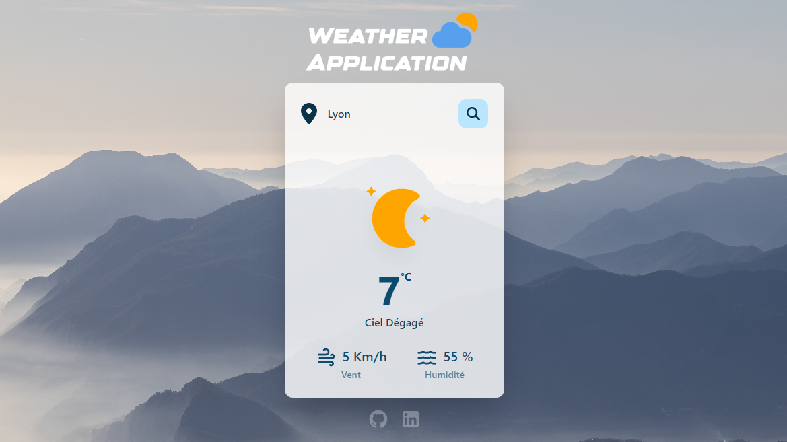

<p align="center">

<p/>

---

<p align="center">


<p/>
<p align="center">

<a href="https://weather-app.fontaine-romain.fr/">Live Demo</a>
</p>

---

## Project Setup

Two ways to start the project:

### With Docker & Docker Compose

```sh
docker compose up -d
```

### With Node & npm

```sh
npm install
npm run dev
```

### Run in production
```sh
docker compose -f docker-compose.production.yml up -d
```